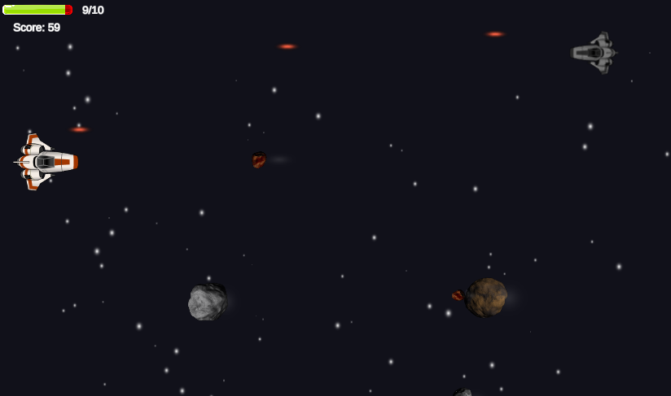

# Space Shooter: Galactic Warfare

## Description

*Space Shooter: Galactic Warfare* is an action-packed 2D arcade-style game where you take command of a state-of-the-art spacecraft in an epic intergalactic battle. Your mission is to defend the galaxy against relentless waves of invading enemies.

## Features

- **Intense Action:** Get ready for a heart-pounding experience as you face endless waves of approaching enemies. Quick reflexes and precise shooting skills are essential for survival.

- **Simple Controls:** The game features intuitive and straightforward controls, making it accessible to players of all ages.

## How to Play

To play *Space Shooter: Galactic Warfare*, follow these simple instructions:

- **Movement:** Use the "W," "A," "S," and "D" keys to navigate your spacecraft through the vastness of space.

- **Firing:** Press the "SPACE" key to unleash powerful projectiles and engage in intense combat with enemy ships.

## Installation

Just download this project and open it in Unity.
